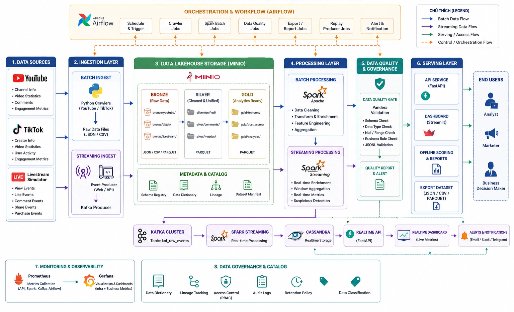

# KOLTrust

KOLTrust là hệ thống mô phỏng quy trình Big Data nhằm đánh giá mức độ tin cậy (Trust Score) của KOL/Creator dựa trên dữ liệu mạng xã hội và các sự kiện livestream theo thời gian thực.

## Demo

🌐 Live Demo: https://huggingface.co/spaces/liamxdev/koltrust-simulator

Các tính năng chính:

- Phân tích và chấm điểm độ tin cậy (Trust Score) cho creator trên TikTok và YouTube.
- Dashboard trực quan với thống kê tổng quan, phân phối mức độ tin cậy và bảng xếp hạng creator.
- Bộ lọc theo nền tảng, mức độ tin cậy, nguồn điểm số và ngưỡng lượt xem.

Lưu ý: Dữ liệu KOL trong demo chỉ phục vụ mục đích mô phỏng và nghiên cứu, không phản ánh đánh giá chính thức đối với bất kỳ cá nhân hoặc tổ chức nào.

## Thành phần chính

* **data-pipeline**: Thu thập dữ liệu từ YouTube/TikTok, thực hiện ETL theo lô (Batch ETL) và xây dựng các tầng dữ liệu Bronze → Silver → Gold → Serving.
* **livestream-simulator**: Sinh dữ liệu livestream giả lập dựa trên các hồ sơ creator trong tập `analysis_profile`.
* **realtime-kol-trust**: Hệ thống thời gian thực bao gồm API, Dashboard, Kafka, Spark, Cassandra, Airflow, MinIO, Prometheus và Grafana.
* **koltrust_common**: Thư viện dùng chung để quản lý và phân giải đường dẫn dữ liệu.

## Setup

```bash
uv sync
uv run python -m doctor
```

## Thu thập dữ liệu

### Nguồn dữ liệu đầu vào

```text
data-pipeline/data/input/vn_channels.txt
data-pipeline/data/input/tiktok_usernames.txt
```

### Thu thập dữ liệu thô

```bash
uv run --directory data-pipeline python crawl_raw_data.py
uv run --directory data-pipeline python crawl_tiktok_data.py
```

### Dữ liệu đầu ra

```text
data-pipeline/data/raw/
```

## ETL và Kiểm tra chất lượng dữ liệu

Xây dựng và xác thực bộ dữ liệu đã xử lý:

```bash
uv run python -m build-dataset
uv run python -m validate-data
```

### Dữ liệu đầu ra

```text
data-pipeline/data/processed/bronze/
data-pipeline/data/processed/silver/
data-pipeline/data/processed/gold/
data-pipeline/data/processed/serving/
realtime-kol-trust/dataset/
```

## Phân chia dữ liệu cho mô hình

Dữ liệu YouTube/TikTok sau khi xử lý được phân chia theo từng creator:

```text
train split            -> Huấn luyện mô hình
eval split             -> Đánh giá ngoại tuyến (Offline Evaluation)
analysis_profile split -> Phân tích và làm dữ liệu hạt giống cho bộ mô phỏng
```

Trình mô phỏng có thể tái sử dụng tên creator và các trường thông tin hồ sơ từ tập `analysis_profile`, nhưng sẽ tạo mới hoàn toàn các chỉ số và sự kiện livestream.

Hệ thống dự đoán thời gian thực không sử dụng nhãn huấn luyện làm dữ liệu đầu vào.

## Các lệnh Debug ngoại tuyến

Các lệnh dưới đây chỉ dùng để kiểm tra nhanh (Smoke Test), không thuộc luồng xử lý thời gian thực chính:

```bash
uv run python -m process-sample
uv run python -m pull-simulator-sample --kol-id yt_finance_04 --limit 500
```

### Luồng xử lý thời gian thực chính

```text
Simulator API
→ Replay Producer
→ Kafka (kol_raw_events)
→ Spark Streaming
→ MinIO (raw / processed / serving)
→ Cassandra Serving Table
→ API / Dashboard
```

## Chạy dịch vụ cục bộ (Local Services)

```bash
uv run --directory livestream-simulator python -m uvicorn app.main:app --reload --port 8010

uv run --directory realtime-kol-trust python -m uvicorn backend.fastapi.main:app --reload --port 8000

uv run --directory realtime-kol-trust python -m streamlit run dashboard/streamlit/app.py
```

### Truy cập

```text
Simulator: http://localhost:8010/docs
API:       http://localhost:8000/docs
Dashboard: http://localhost:8501
```

## Chạy toàn bộ hệ thống bằng Docker

Khởi động toàn bộ stack:

```bash
docker compose --project-directory realtime-kol-trust up --build
```

### Các dịch vụ bao gồm

* Kafka + Kafka UI
* Cassandra
* Spark Streaming
* FastAPI
* Streamlit
* Simulator + Replay Producer
* Airflow
* MinIO
* Prometheus
* Grafana

### Địa chỉ truy cập

```text
API:        http://localhost:8000/docs
Dashboard:  http://localhost:8501
Kafka UI:   http://localhost:8080
Airflow:    http://localhost:8081
MinIO:      http://localhost:9002
Prometheus: http://localhost:9090
Grafana:    http://localhost:3000
```

### Stop Docker

```bash
docker compose --project-directory realtime-kol-trust down
```

## MinIO

Đưa bộ dữ liệu Batch lên MinIO:

```bash
uv run python -m publish-minio
```

### Các Bucket

```text
koltrust-raw
koltrust-processed
koltrust-serving
```

## Quick CLI

```bash
uv run python -m doctor
uv run python -m build-dataset
uv run python -m validate-data
uv run python -m pipeline
uv run python -m publish-minio
```

## Documents

```text
documents/SOURCE_LAYOUT.md
documents/PRESENTATION.md
documents/API_DOCS.md
documents/MONITORING.md
documents/GOVERNANCE.md
airflow/dags/koltrust_pipeline_dag.py
```

## Kiến trúc tổng thể

